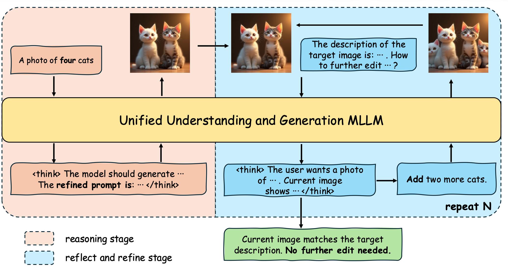

# Understanding VS. Generation: Navigating Optimization Dilemma in Multimodal Models

This repository contains the code for the paper [Understanding VS. Generation: Navigating Optimization Dilemma in Multimodal Models](https://arxiv.org/abs/2602.15772)

> **Understanding VS. Generation: Navigating Optimization Dilemma in Multimodal Models**   
> Sen Ye, Mengde Xu, Shuyang Gu, Di He, Liwei Wang, Han Hu   
> PKU, Tencent 


## Overview
We propose the **Reason-Reflect-Refine (R3)** framework. R3 re-frames the single-step generation process into a multi-step process of "generate-understand-regenerate". We optimize R3 with **Tree-RL** strategy, which simultaneously optimizes model's generation and understanding capabilities.

This repository contains the code for training Bagel model with R3 framework. We utilize **Tree-RL** to split the rollout process into multiple stages. We adopt GRPO to optimize the text reasoning process and Mix-GRPO to optimize the diffusion process.



## Installation
```bash
conda create -n bagel_r3 python=3.10 -y
conda activate bagel_r3
pip install -r requirements.txt
pip install flash_attn==2.5.8 --no-build-isolation
```

Download the model checkpoint from [Hugging Face](https://huggingface.co/ByteDance-Seed/BAGEL-7B-MoT) and place it in the `checkpoints` directory.


## Usage
We provide a doc in tutorial.md detailing how to train R3 on various datasets.

## Citation
If you find this work useful, please consider citing:
```bibtex
@misc{ye2026understandingvsgenerationnavigating,
      title={Understanding vs. Generation: Navigating Optimization Dilemma in Multimodal Models}, 
      author={Sen Ye and Mengde Xu and Shuyang Gu and Di He and Liwei Wang and Han Hu},
      year={2026},
      eprint={2602.15772},
      archivePrefix={arXiv},
      primaryClass={cs.CV},
      url={https://arxiv.org/abs/2602.15772}, 
}
```
